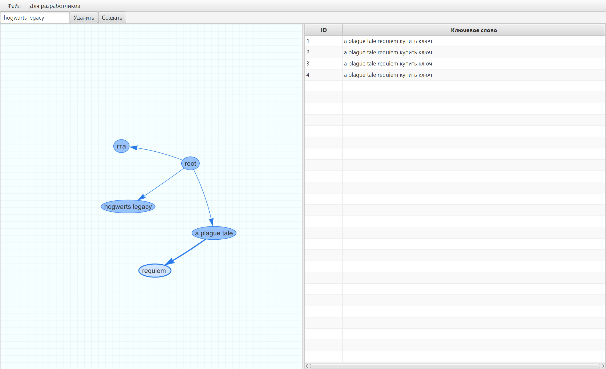

# Что это?
Инструмент для группировки (кластеризации) ключевых слов с помощью регулярных выражений. Вы начинаете с общего списка.
Затем создаёте новую группу, указывая условие (например, регулярное выражение `.*игра.*`). В новую группу
автоматически попадут все подходящие запросы (купить игру, скачать игру бесплатно). Этот процесс можно повторять,
создавая древовидную структуру уточняющих групп



# Функционал

- Сохранение проекта в JSON/CSV
- Загрузка проекта из JSON
- Добавление и удаление кластеров
- Отображение ключевых слов у выбранного кластера

# Используемые технологии

| Технология                                                                                                        | Назначение                                      |
|-------------------------------------------------------------------------------------------------------------------|-------------------------------------------------|
| [Kotlin](https://kotlinlang.org/)                                                                                 | Основной язык                                   |
| [JavaFX](https://fxdocs.github.io/docs/html5/)                                                                    | Для UI                                          |
| [mvvmFX](https://github.com/sialcasa/mvvmFX)                                                                      | Для реализации архитектуры Model-View-ViewModel |
| [Vis Network](https://visjs.github.io/vis-network/docs/network/)                                                  | JS библиотека для визуализации графов           |
| [WebView](https://docs.oracle.com/javase/8/javafx/api/javafx/scene/web/WebView.html)                              | Контейнер для отображения веб-контента в JavaFX |
| [Самопальный мост между JS и Kotlin](https://docs.oracle.com/javase/8/javafx/api/javafx/scene/web/WebEngine.html) | Для синхронизации состояния между JavaFX и JS   |

# Запуск и разработка

Предварительные требования: Установите JDK 21.
Структура проекта: Стандартная структура Gradle-проекта. Исходный код в src/main/kotlin.

## Для запуска приложения
`./gradlew run`

## Для сборки JAR
`./gradlew build`

# Более подробное объяснение приложения

## Структура данных и объектное представление графа
В коде граф хранится как глобальный словарь смежности (Adjacency Map).

- Ключ в мапе: Уникальное название узла (regex).
- Значение в мапе: Сам объект узла, который хранит:
  - Ссылку на родителя (parentId)
  - Список своих дочерних узлов (neighbors)
  - Список ключевых слов, которые в него входят (keywords)

Простой пример как если мапа была бы в виде JSON:

```json
{
  "graph": {
    "root": {
      "parentId": "",
      "neighbors": ["rainbow six siege"],
      "keywords": [
        "купить игру",
        "купить ключ",
        "купить офлайн аккаунт",
        "купить аккаунт дешево"
      ]
    },
    "rainbow six siege": {
      "parentId": "root",
      "neighbors": ["аккаунт", "ключ"],
      "keywords": ["купить rainbow six siege"]
    },
    "аккаунт": {
      "parentId": "rainbow six siege",
      "neighbors": [],
      "keywords": ["купить аккаунт rainbow six siege"]
    },
    "ключ": {
      "parentId": "rainbow six siege",
      "neighbors": [],
      "keywords": ["купить ключ rainbow six siege"]
    }
  }
}
```

## Логика работы приложения

### Добавление нового кластера

1. Выбор источника — система берет ключевые слова из родительского кластера
2. Фильтрация — отфильтровывает их по указанному регулярному выражению
3. Перенос данных — перемещает найденные совпадения из родительского кластера в новый
4. Обновление интерфейса — синхронизирует изменения в WebView

### Удаление кластера

1. Извлечение данных — система берет ключевые слова из удаляемого кластера
2. Поиск родителя — находит родительский узел через поле parentId
3. Возврат данных — добавляет ключевые слова обратно в родительский кластер
4. Очистка связей — удаляет кластер из списка соседей родителя
5. Удаление из памяти — исключает кластер из глобального словаря
6. Обновление интерфейса — применяет изменения в WebView

### Сохранение проекта

1. Сериализация — преобразует глобальный словарь кластеров в JSON/CSV формат

### Загрузка проекта

1. Десериализация — восстанавливает структуру данных из JSON в глобальный словарь
2. Восстановление графа — с помощью алгоритма обхода в глубину графа
3. Обновление интерфейса — применяет восстановленную структуру в WebView

## Визуализация и мост между JS и JavaFX (WebView)

Реализация связи между JVM и JS выполнена в рамках паттерна MVVM через класс GraphView.

## Загрузка WebView

1. Загружается HTML страница с библиотекой vis-network
2. После загрузки страницы Kotlin объект GraphView передается в JS окружение

```kotlin
override fun initialize(p0: URL?, p1: ResourceBundle?) {
        webEngine.load(this::class.java.getResource("graphView.html")!!.toString())
        super.setCenter(webView)

        webView.engine.loadWorker.stateProperty().addListener {_, _, newVal ->
            if (newVal == Worker.State.SUCCEEDED) {
                val windowJs: JSObject = webEngine.executeScript("window") as JSObject
                windowJs.setMember(this.javaClass.simpleName, this)
            }
        }

        initListeners()
    }
```

## Синхронизация состояния

- Изменения в данных (добавление/удаление кластеров) отслеживаются через слушатели
- При изменениях автоматически вызываются соответствующие JS-команды

## Ключевые методы

| Метод                   | Направление | Назначение                                |
|-------------------------|-------------|-------------------------------------------|
| `selectNode(id)`        | JS → Kotlin | Обновляет выбранный узла                  |
| `deselectNode()`        | JS → Kotlin | Сбрасывает выбор узла                     |
| `addNode(id)`           | Kotlin → JS | Добавляет узел                            |
| `addEdge(from, to)`     | Kotlin → JS | Создает связь между узлами                |
| `addNodesRecursively()` | Kotlin → JS | Восстанавливает граф при загрузке проекта |

Методы `selectNode(id)` и `deselectNode()` связаны (binding) с состоянием выбранного узла в графе.
При изменении выбранного узла автоматически обновляется таблица ключевых слов. В свою очередь, в таблице
отображаются ключевые слова именно выбранного кластера.

Таким образом, весь пользовательский интерфейс синхронизируется через слушатели,
как предполагает паттерн проектирования Model-View-ViewModel

Этот проект — эксперимент и полигон для опытов. Не стоит в принципе его использовать. Ценность — в коде 😁

